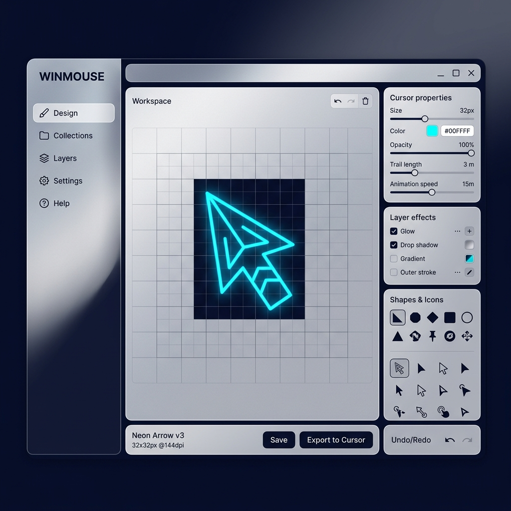

# WinMouse — Windows Custom Cursor Generator & Customizer 🚀

<p align="center">
  
</p>

<p align="center">
  <a href="https://github.com/vuckuola619/winmouse/actions/workflows/ci.yml">
    
  </a>
  
  
  
</p>

WinMouse (also known as Molten Cursor) is a premium, lightweight desktop application built using Python/Flask and pywebview. It wraps an advanced custom cursor engine within a beautiful, glassmorphic native desktop interface to compile and apply custom Windows cursors globally.

---

## ✨ Features

- 🖥️ **Native Desktop Container**: Wraps the web application in a fixed-size `1080x720` desktop window using Microsoft Edge WebView2 (`pywebview`).
- 🎨 **Frosted Glass (Titanium MDM) Aesthetics**: A stunning glassmorphic UI defaulting to a premium **Silver-Frosted Light Theme** on startup, with a hot-toggle to the **Dark Navy Theme**.
- 📐 **High-DPI Multi-Resolution Compiler**: Scales static cursor images (`.cur`) automatically to multiple standard DPI resolutions `(32, 48, 64, 96, 128)` using high-quality PIL Lanczos resampling.
- 🎬 **Animated Cursor Engine (`.ani`)**: Compiles `.gif` animations into RIFF/ACON container byte streams with even byte-padded `.cur` frames for smooth Windows loading states.
- 🪓 **Smart Background Removal**: Built-in BFS Flood Fill background eraser starting from corners, alongside global Chroma key color picking.
- 🖌️ **Pixel-Art Drawing Canvas**: Draw custom icons directly onto a 32x32 interactive canvas with undo-clear tools.
- 🔬 **Interactive Tester Sandbox**: Live hover-testing area to check cursor behavior and hotspots instantly before applying them globally.

---

## 🛠️ Tech Stack & Requirements

- **Backend**: Python 3.12+ / Flask
- **Frontend**: Vanilla HTML5 / CSS3 (CSS Variables for themes) / JavaScript (ES6)
- **Desktop Wrapper**: PyWebView (Edge WebView2 Runtime required on target machine)
- **Image Processing**: Pillow (PIL)

---

## 🚀 Getting Started

### 1. Installation
Clone the repository:
```bash
git clone https://github.com/vuckuola619/winmouse.git
cd winmouse
```

Create a virtual environment and install the dependencies:
```bash
python -m venv .venv
.venv\Scripts\activate
pip install -r requirements.txt
```

### 2. Configure Environment
Create a `.env` file in the root directory:
```env
# Optional: Hugging Face API key to unlock FLUX.1-schnell AI generation
HF_TOKEN=your_token_here
FLASK_SECRET_KEY=generate_a_random_key_here
```

### 3. Run Locally
Run the standalone launcher:
```bash
python main.py
```
This spawns the background Flask daemon and opens the native `1080x720` desktop frame.

---

## 🧪 CI/CD Workflow

The repository is equipped with a GitHub Actions workflow (`.github/workflows/ci.yml`) running on `windows-latest`. The pipeline:
1. Checks out the repository.
2. Configures Python 3.12.
3. Installs project dependencies.
4. Executes the automated test suite (`python -m unittest test_cursor.py`) to validate cursor compilations, hotspots scaling, and animated `.ani` alignments.

---

## 🌿 Git Worktree Workflow

This project encourages the use of **Git Worktrees** for managing multiple branches concurrently without having to stash changes or switch working directories.

### Setup a Feature Worktree
To work on a feature (e.g. `feature/compact-ui`) while keeping your `main` branch immediately accessible:
```bash
# 1. Create and check out a new branch in a sibling directory
git worktree add ../winmouse-compact-ui -b feature/compact-ui

# 2. Navigate to the new working directory
cd ../winmouse-compact-ui

# 3. Work on your changes, run tests, and commit normally
git commit -am "refactor: compact layouts and theme variables"
git push origin feature/compact-ui
```

### Listing & Pruning Worktrees
To see all active worktrees:
```bash
git worktree list
```
When you are done with a feature and have merged the branch:
```bash
git worktree remove ../winmouse-compact-ui
git branch -d feature/compact-ui
```
